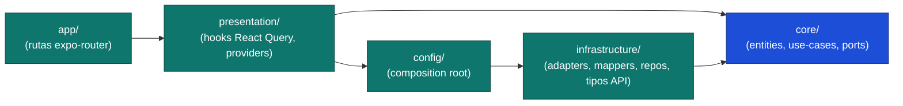
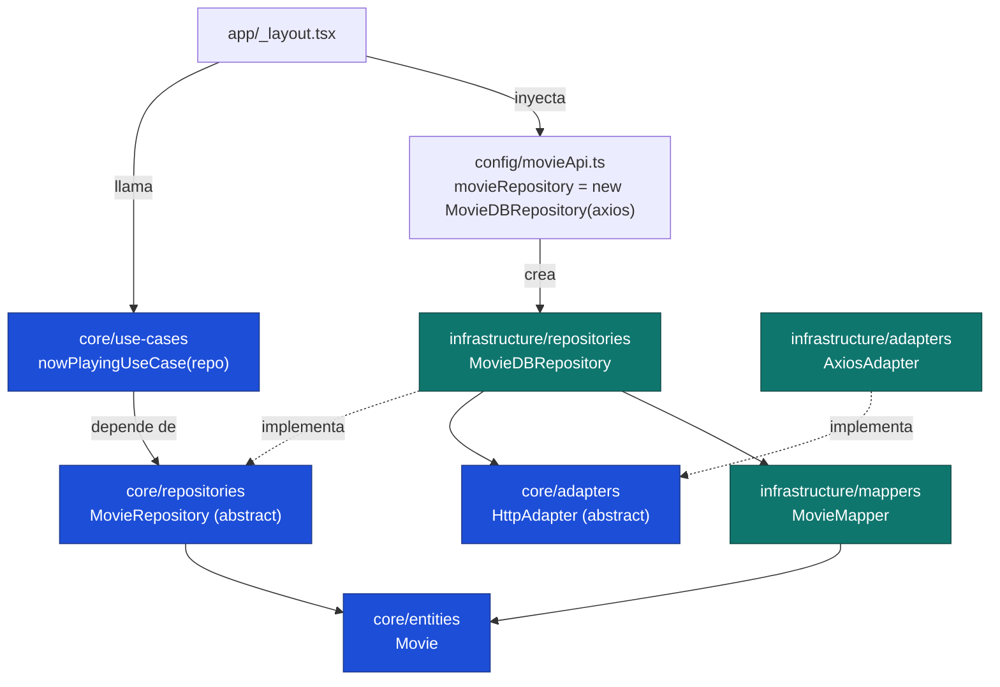

# Arquitectura — Clean Architecture

## Regla de dependencias

Las flechas apuntan **solo hacia adentro**. Una capa nunca importa de una capa más externa.



- **core** = corazón. Cero dependencias externas. Solo TypeScript puro.
- **infrastructure** depende de core (implementa sus ports).
- **config** = composition root: crea instancias concretas y las cablea.
- **presentation** = estado de UI (React Query). Los hooks envuelven use-cases; nunca acceden a infrastructure directo.
- **app** = rutas expo-router; consumen hooks de presentation.

## Flujo de "now playing" (port pattern)



Clave: `nowPlayingUseCase` depende del **port** `MovieRepository` (abstracción en core),
no de la implementación concreta. Cambiar de TMDB a otra API = nueva impl del port; core no se toca.

## Verificación automática

```bash
pnpm arch          # valida regla de dependencias; falla si hay violación
pnpm arch:graph:md # genera dependency-graph.mmd (Mermaid, sin deps externas)
pnpm arch:graph    # genera dependency-graph.svg (requiere Graphviz: sudo apt install graphviz)
```

El grafo real de módulos (autogenerado) vive en `dependency-graph.mmd`.
